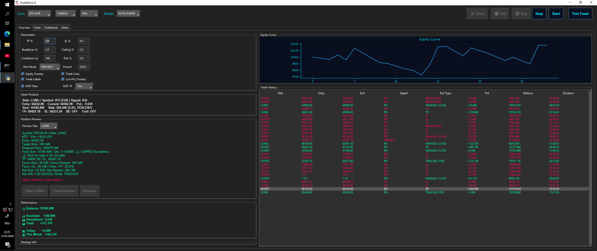
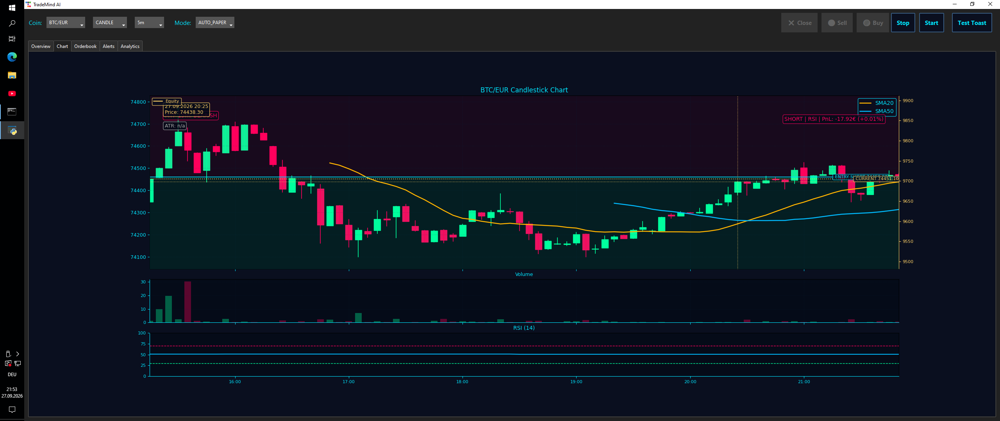
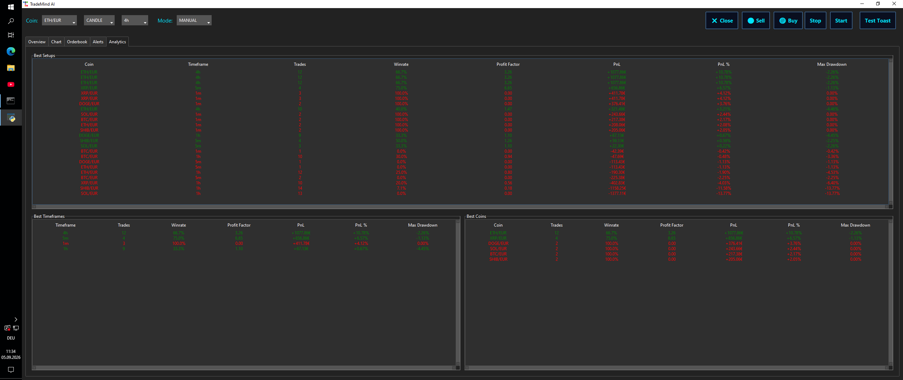

# TradeMind AI

TradeMind AI ist ein persönliches Python-Projekt zur Marktanalyse, Simulation von Trading-Strategien und KI-gestützten Entscheidungsunterstützung.

Das Projekt wurde modular aufgebaut und verbindet Datenverarbeitung, technische Analyse, Backtesting, Risiko-Logik und mehrere spezialisierte KI-Komponenten.

## Highlights

- Python-basierte modulare Architektur
- Markt- und Preisdatenverarbeitung
- Pandas / NumPy
- technische Indikatoren
- Backtesting
- Risiko- und Positionsmanagement
- AI Advisor
- Agent Runtime
- spezialisierte KI-Agenten
- Memory-System
- Narrative Engine
- Strategy Engine
- Testing und Regressionstests
- Git / GitHub
- Deployment auf Windows-VPS

## Architektur

Die öffentliche Portfolio-Version enthält unter anderem:

- `agent_runtime.py`
- `agents.py`
- `ai_advisor_engine.py`
- `ai_memory.py`
- `ai_narrative.py`
- `capability_registry.py`
- `intelligence_engine.py`
- `strategy_engine.py`
- `trading_core/`

## Technologien

- Python
- Pandas
- NumPy
- ccxt
- Matplotlib
- Tkinter / ttkbootstrap
- REST / API-Konzepte
- Git / GitHub

## Ziel des Projekts

TradeMind AI dient als praktische Entwicklungsplattform für:

- Softwarearchitektur
- Python-Entwicklung
- Datenanalyse
- APIs
- Testing
- KI-gestützte Systeme
- Agentenarchitekturen
- Trading-Simulation und Backtesting

## Sicherheit

Dieses öffentliche Repository enthält keine:

- API-Keys
- Passwörter
- privaten Zugangsdaten
- Server-Zugangsdaten
- produktiven Trading-Zugangsdaten

Bestimmte interne Strategieparameter und private Laufzeitdaten wurden bewusst nicht veröffentlicht.

## Hinweis

TradeMind AI ist ein persönliches Softwareprojekt und keine Anlageberatung.

## Screenshots

> Screenshots show simulated/paper-trading and backtest data for demonstration purposes.

### Trading Dashboard

### Candlestick Chart & Technical Analysis

### Analytics & Backtest Overview

